# Vogue School

## Project Overview

Vogue school is a educational platform that our team build to help children across the world to have acccess to free education for primary till elementry school students.Following the United Nations Sustainable Development Goals (SDG) to ensure inclusive and equitable quality education. We believe with our platform will help every children to have access to the best education especially on basic numeracy and literacy skills they need to succeed in life.

## Technical Documentation

**Front End**
The UI development done in front end use React js include libraries as follow:

- Tailwind = for CSS Styling
- React Router Dom = Manage router pages
- Font-awesome and react icons = for beatiful web icons
- Axios = For fetching API from Backend
- Yup = For form validations
- Slick-carousel = for carousel slide show

Folder structure architecture:

- Components = store reusable components that will be used in pages
- Assets = store applicaton asset images that will be display in UI
- Layouts = Manage Authentication layer needed for router
- pages = Store each pages
- app.jsx = Main file to Manage route path for each pages

## User Manuals

How to use our application:

### Account

**Register Account**

Open [vogue school](https://dev--vogueschool-dev-env.netlify.app/)

1. Click login button
2. Click Create account now
3. Fill in form username, birthday, phone number, email and password
4. Click create account
5. Congratulation your account is created, it will automatically login as student and redirect to the dashboard page
   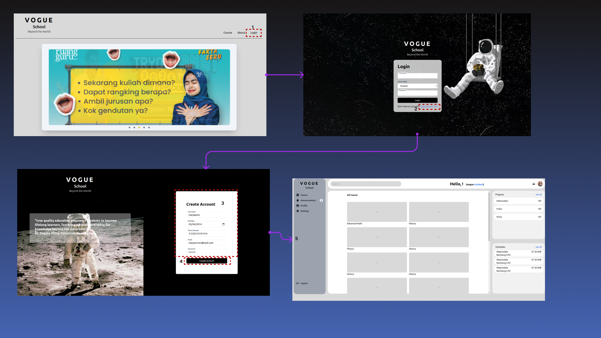

**Login Account**

Open [vogue school](https://dev--vogueschool-dev-env.netlify.app/)

1. Click login button
2. Fill in form username, role, and password
3. Click login
4. It will redirect to the dashboard page
   
   **Logout Account**

5. Login or Register account
6. in Dashboard page click on the logout button that is located on the bottom of the left sidebar
7. Your account will be logout and redirect back to homepage
   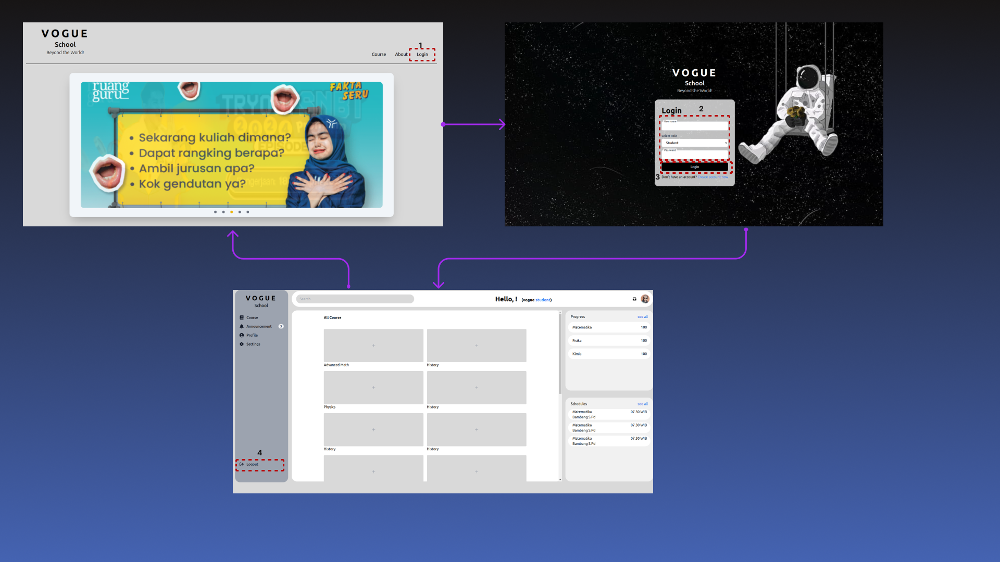
   **_nb: UI dashboard for role student and teacher will be sligtly different_**
   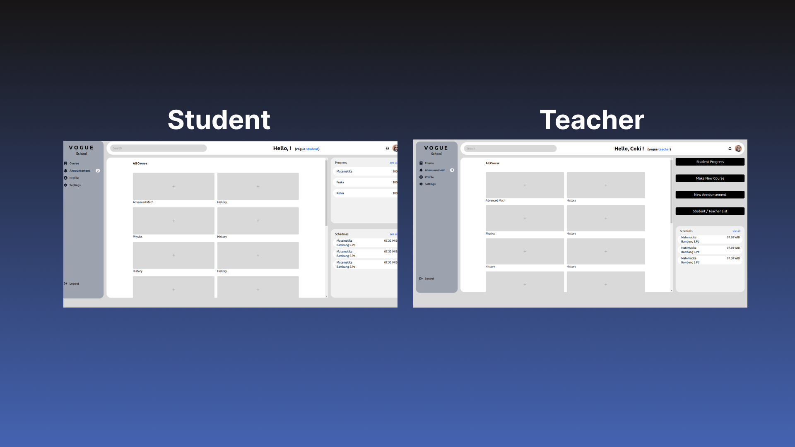

### Course

**_Student_**
**Add Course**

1. Access dashboard by login / register as student
2. Click on the + button on the available course
   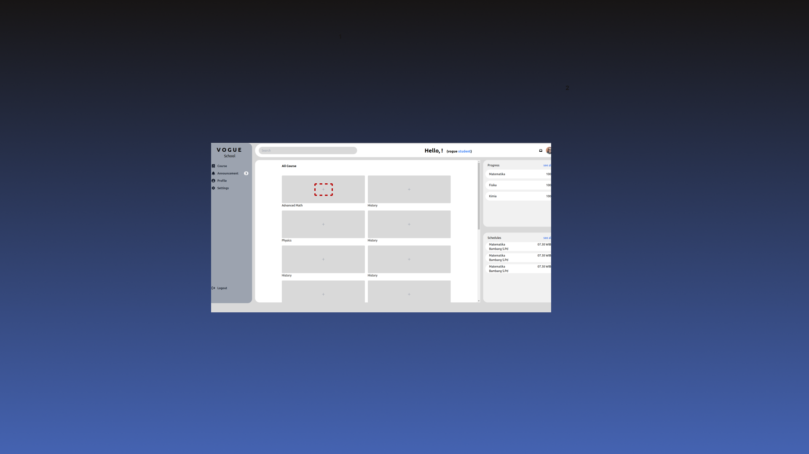

**_Teacher_**
**Create Course**

1. Access dashboard by login / register as teacher
2. Click make new course
3. Click create
4. Input form course name, subject, grade, upload image, and description
5. Click create
   

**Update Course**

1. Access dashboard by login / register as teacher
2. Click make new course
3. Click pen icon
4. Input form course name, subject, grade, upload image, and description
5. Click update
   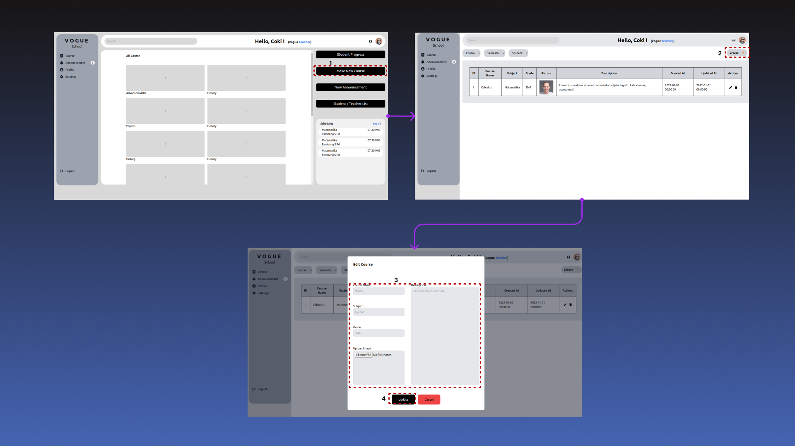

**Delete Course**

1. Access dashboard by login / register as teacher
2. Click make new course
3. Click bin icon
4. Click delete
   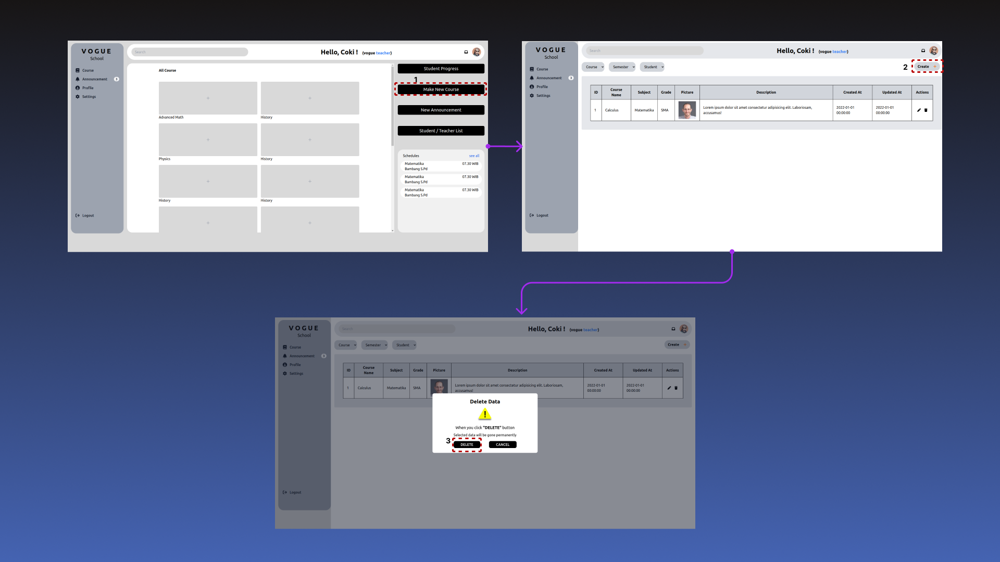

### Announcement

**_Student_**
**View Announcement**

1. Access dashboard by login / register as student
2. Click announcment on sidebar
3. Announcements display
   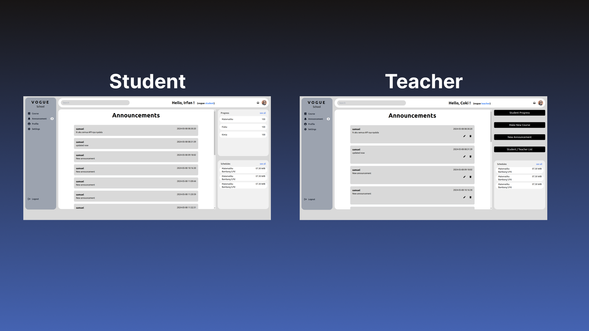

**_Teacher_**
**Create Announcement**

1. Access dashboard by login / register as teacher
2. Click new announcement located on the right side controller buttons
3. It will show a pop and fill in anouncment field
4. Click yes
   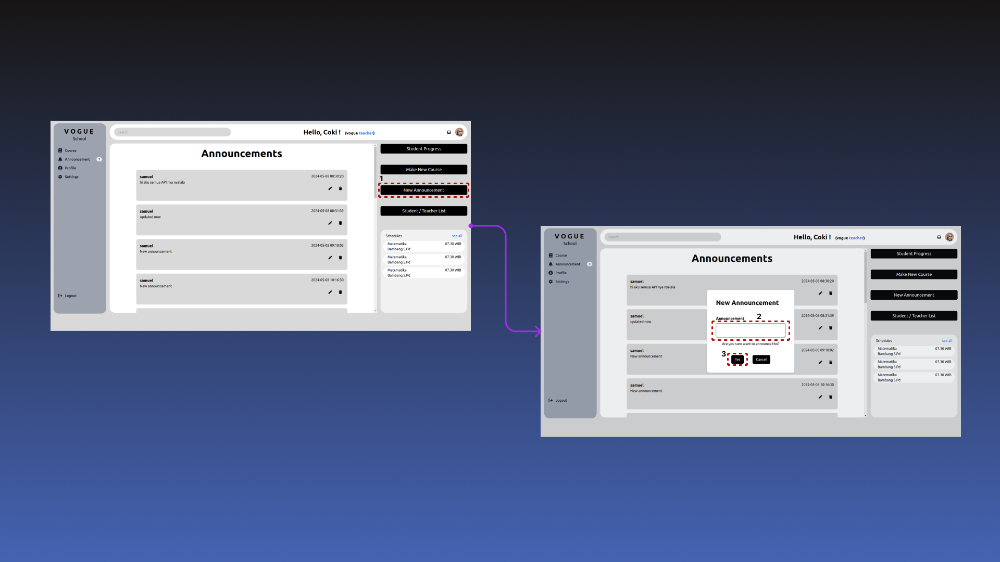

**Update Announcement**

1. Access dashboard by login / register as teacher
2. Click the pen icon
3. It will show a pop and fill in anouncment field
4. Click yes
   

**Delete Announcement**

1. Access dashboard by login / register as teacher
2. Click the bin icon
3. It will show a pop and fill in anouncment field
4. Click yes
   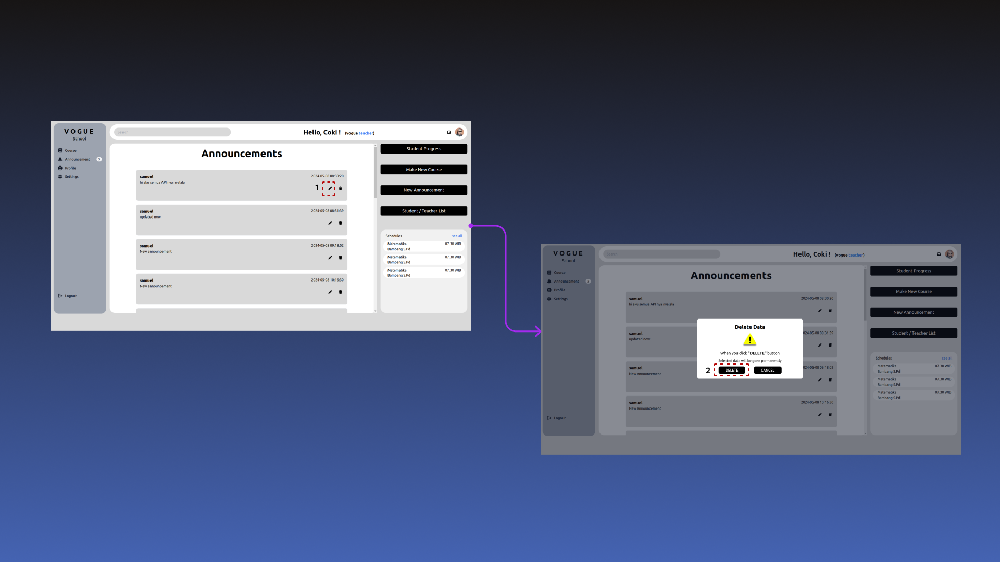

### Profile

**Change Profile Picture**

1. Access dashboard by login / register
2. Click profile click change on user photo
3. Click choose file
4. Select new picture file in your computer
5. Click yes
   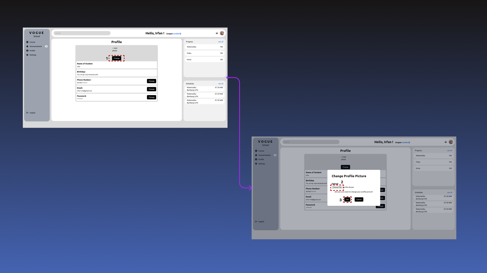
   **Change Phone Number**

6. Access dashboard by login / register
7. Click profile
8. Click change on phone number field
9. Input new phone number in text field
10. Click yes
    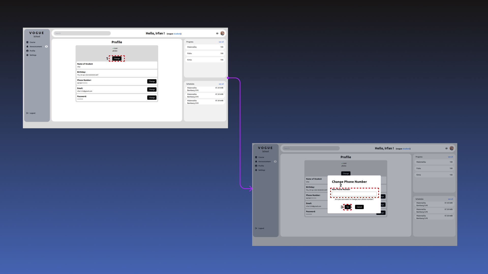

**Change Email**

1. Access dashboard by login / register
2. Click profile
3. Click change on email field
4. Input new phone number in text field
5. Click yes
   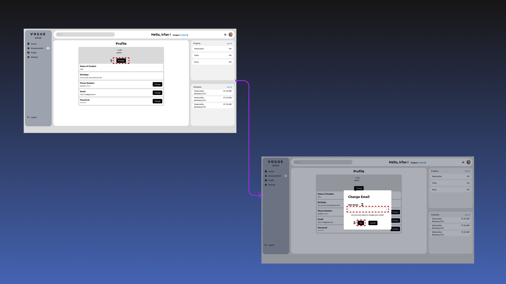

**Change Password**

1. Access dashboard by login / register
2. Click profile
3. Click change on password field
4. Input new password in text field
5. Click yes
   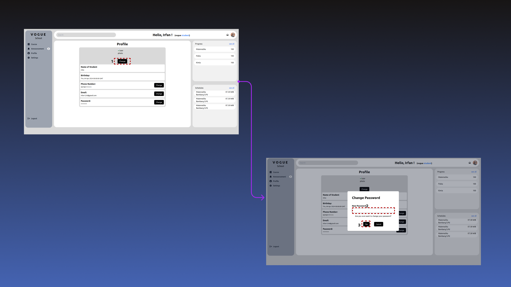

### Settings

**Change Mode**

1. Access dashboard by login / register
2. Click settings
3. Click dark on mode setting field to change mode to dark
4. Click again light on mode setting field to change to light

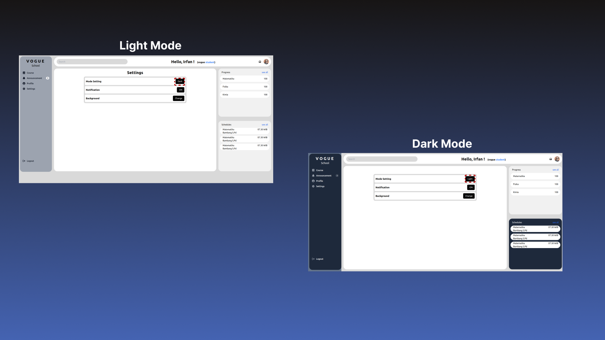

### Student & Teacher List

**Create New Student/Teacher**

1. Access dashboard by login / register
2. Click student/teacher list
3. Select Role teachers or students
4. Click Create
5. Input form data name, phone, email, upload image
6. Click Create
   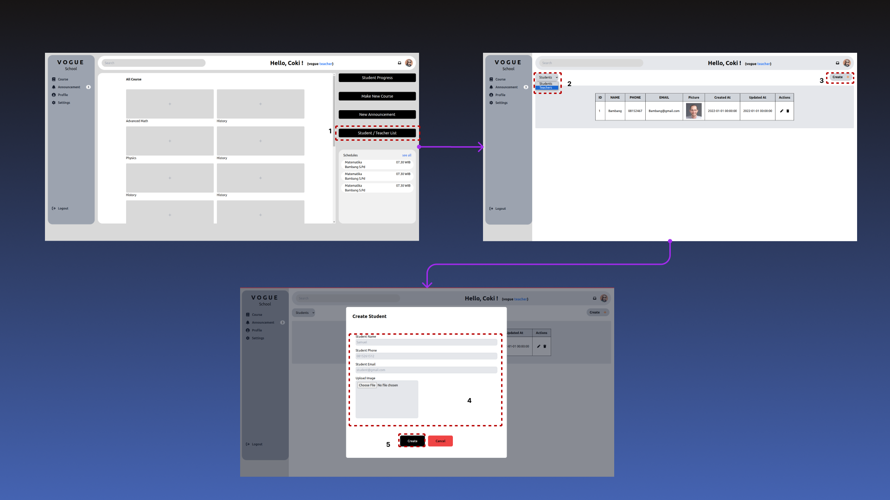

**Update New Student/Teacher**

1. Access dashboard by login / register
2. Click student/teacher list
3. Select Role teachers or students
4. Click pen icon in table
5. Input form data name, phone, email, upload image
6. Click update
   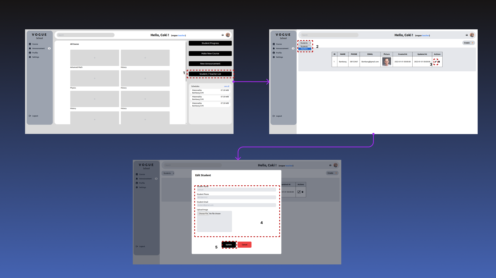

**Create New Student/Teacher**

1. Access dashboard by login / register
2. Click student/teacher list
3. Select Role teachers or students
4. Click bin icon in table
5. Click delete
   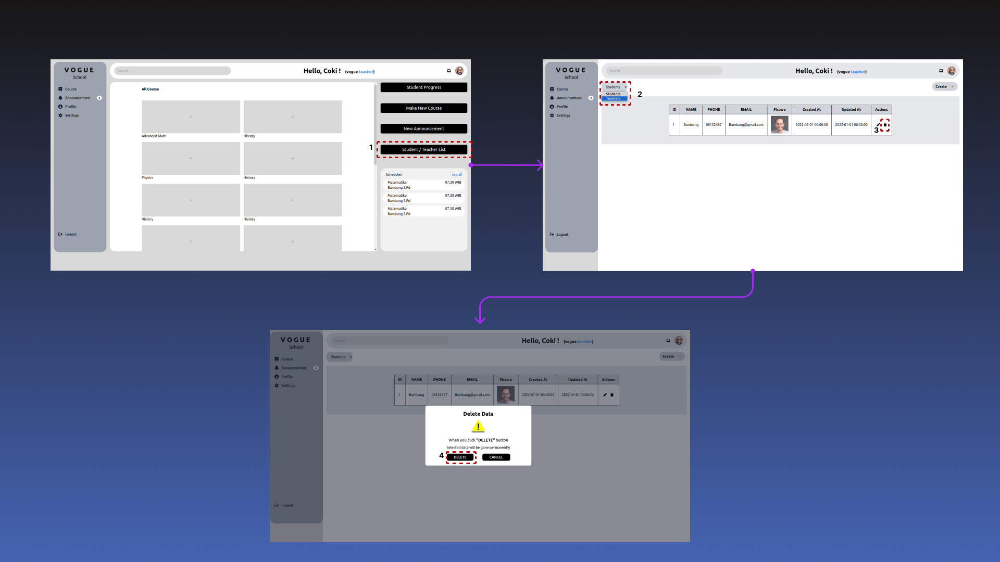
